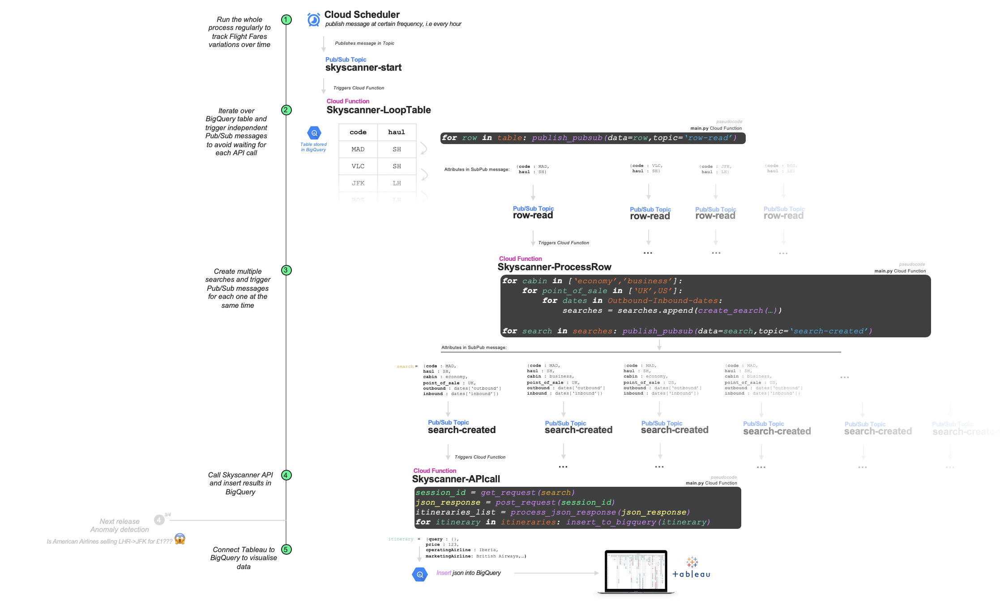

# gcloud-skyscanner-api


```
├── assets
│   ├── airport_codes_200.csv
│   └── images
│       └── bigpicture.png
├── README.md
└── src
    └── CF-Skyscanner-ProcessRow
        └── main.py
        └── helpers.py
        └── requirements.txt
    └── CF-Skyscanner-ProcessRow
        └── main.py
        └── helpers.py
        └── requirements.txt
    └── CF-Skyscanner-ProcessRow
        └── main.py
        └── helpers.py
        └── requirements.txt
    └── setup
        └── main.py
        └── helpers.py
        └── requirements.txt
 ```
    
    

Costs
This tutorial uses billable components of Cloud Platform, including:

Google Cloud Functions
Google Cloud Pub/Sub
Google Cloud Scheduler


Pub/Sub CLient Libraries: https://cloud.google.com/pubsub/docs/reference/libraries


If you are playing locally with python and gcloud, you may face the following error message:
```
google.auth.exceptions.DefaultCredentialsError: Could not automatically determine credentials. Please set GOOGLE_APPLICATION_CREDENTIALS or explicitly create credentials and re-run the application. For more information, please see https://cloud.google.com/docs/authentication/getting-started
```

import os 
os.environ["GOOGLE_APPLICATION_CREDENTIALS"]="/users/<username>/<path>/credentials.json"
  
You will have to create a service account following https://cloud.google.com/docs/authentication/production , and you will download a json file that contains your key.




