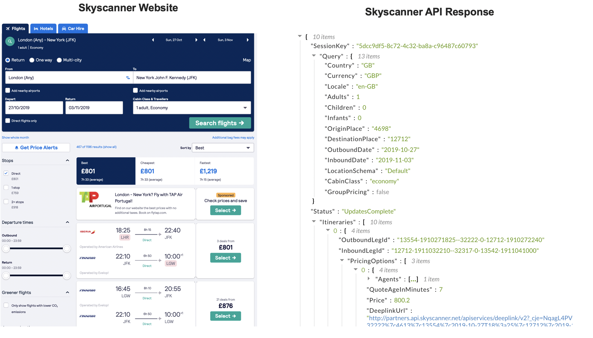
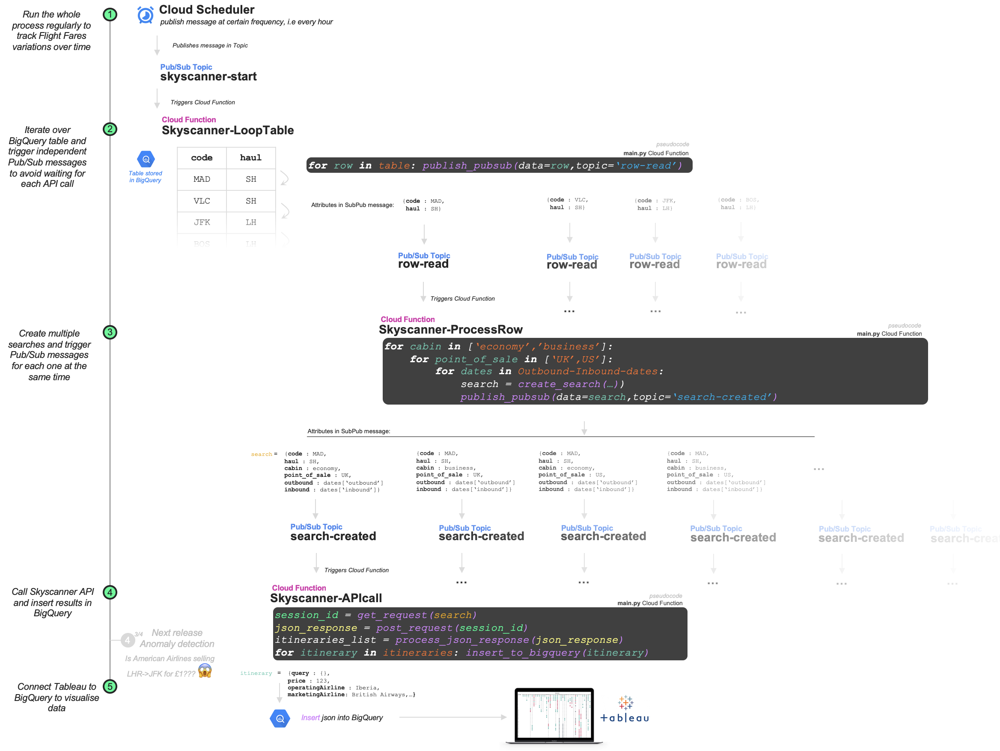
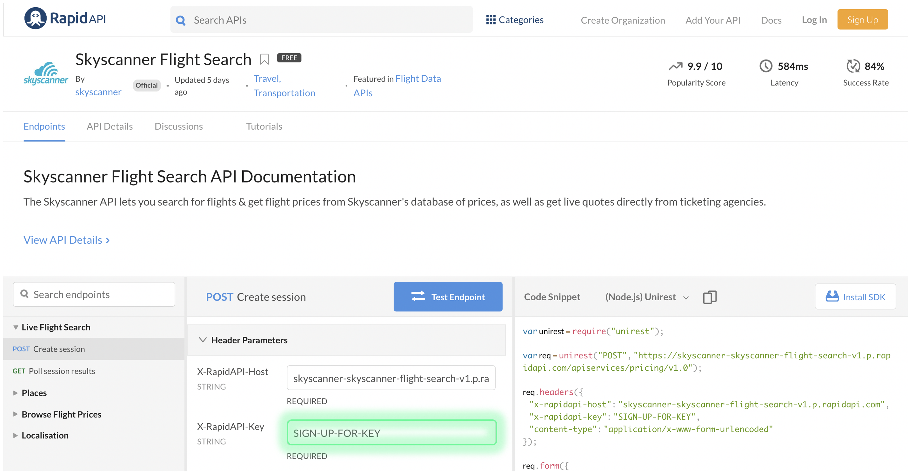
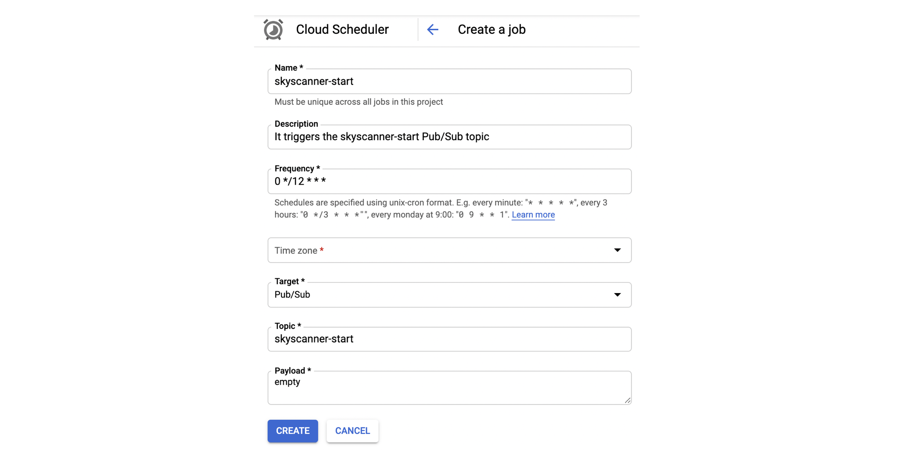

# gcloud-skyscanner-api

This project uses Google [Cloud Functions](https://cloud.google.com/functions/) and [Pub/Sub Topics](https://cloud.google.com/pubsub/docs/) with [Skyscanne API](https://rapidapi.com/skyscanner/api/skyscanner-flight-search) to get fares for different destinations. With these tools and a bit of imagination, you will track fares for your favourite destinations, compare different airlines prices and get the best deal for your holidays 🌴🌞

In a nutshell, this is how it works: 
- Get a `destination code` and `haul` (_Short Haul, Long Haul_) stored in a [table](https://github.com/pabloferg/gcloud-skyscanner-api/blob/master/gcloud-skyscanner/assets/destinationCodes.csv) in [Big Query](https://cloud.google.com/bigquery/).
- Create multiple searches for each destination for different Cabins (_economy, business_), Point of Sale (_UK or US website_) and Departure dates.
- For every combination of these dimensions, you will query the Skyscanner API to get a json file with the list of itineraries containing all the information you would see in the browser version.
- Once you get the json file, you process it (cleaning, decode values,...) and insert it into BigQuery for further analysis. 




Before you continue, be aware that the Google Cloud components used in this project are **billable**, so you could have some costs. If you are a new user you should get some welcome credits, so don't worry at the beginning. 

### Architecture

Instead of reading each `code`-`haul` and calling the API serially - we would follow a **parallel approach** where every iteration across the initial table will trigger a message in Pub/Sub Topic that will trigger a Cloud Function. So we don't have to wait for one search to finish to start a new one.



## Repository structure

`src` folder contains 3 Cloud Functions that you will clone and deploy to Google Cloud. I explain how to do it later. In this folder you will find as well a `setup.py` script that you can follow to set up the environment in GCP similar to the one used in this project (_create and populate Big Query Tables, create Pub/Sub Topic_).


```
├── assets
│   ├── destinationCodes.csv
│   └── images
│       └── bigpicture.png
├── README.md
└── src
    └── CF-Skyscanner-ProcessRow
        └── main.py
        └── helpers.py
        └── requirements.txt
    └── CF-Skyscanner-ProcessRow
        └── main.py
        └── helpers.py
        └── requirements.txt
    └── CF-Skyscanner-ProcessRow
        └── main.py
        └── helpers.py
        └── requirements.txt
    └── setup
        └── setup.py
        └── destinationCodes.csv
 ```
    

### Languages and libraries 

This project uses Python language. In addition, you will need [Google Cloud SDK](https://cloud.google.com/appengine/docs/standard/go/download) - once installed you will use `gcloud` command in your Terminal to deploy and manage your projects. Try to get familiarised with it before moving forward.

Tip: If you are playing locally with Python and `gcloud`, you may face the following error message:
```
google.auth.exceptions.DefaultCredentialsError: Could not automatically determine credentials. Please set GOOGLE_APPLICATION_CREDENTIALS or explicitly create credentials and re-run the application. For more information, please see https://cloud.google.com/docs/authentication/getting-started
```
When you use Google products within Google environment, you don't have to worry about credentials because everything works smoothly - you don't have to set up credentials in your Cloud Functions for example. However, when using `gcloud` locally you will have to create a _service account_ following [this](https://cloud.google.com/docs/authentication/production) procedure , then **you will download a json file that contains your key**.

In your local python environment, run the following code to set the environment variable:
```
import os 
os.environ["GOOGLE_APPLICATION_CREDENTIALS"]="/<path>/<key>.json"
```

### Request access to Skyscanner API on RapidAPI.com

[RapidAPI](https://rapidapi.com/) platform is an easy way to start using Skyscanner API. First, you just need to sign up and find the API [here](https://rapidapi.com/skyscanner/api/skyscanner-flight-search). You can play with the UI on your browser to see how the REST API works, but we will use Python instead because it's more fun. 

You will need your `KEY` to access the API. **You will set this key as environment variable in the Cloud Function calling the API** (Explained later on)




## Initial Setup

1. Create a [Google Cloud Project](https://cloud.google.com/).
2. You will need 3 Cloud Functions and [3 Pub/Sub Topics](https://github.com/pabloferg/gcloud-skyscanner-api/blob/master/gcloud-skyscanner/src/setup/setup.py#L15).


You can read [this](https://cloud.google.com/scheduler/docs/tut-pub-sub) tutorial to have an idea about how this works. 

There are 3 folders in this repository containing 3 Cloud Functions (CF):
```
└── src
    └── CF-Skyscanner-ProcessRow
        └── main.py
        └── helpers.py
        └── requirements.txt
    └── CF-Skyscanner-ProcessRow
        └── main.py
        └── helpers.py
        └── requirements.txt
    └── CF-Skyscanner-ProcessRow
        └── main.py
        └── helpers.py
        └── requirements.txt
```
        
You will deploy this functions using the [Google Cloud SDK](https://cloud.google.com/appengine/docs/standard/go/download). You need to install it first to be able to uset `gcloud` command in your terminal. Once installed, try to get familiarised with it before moving forward.
 
Download the folders. In your Terminal, move to the folder path with `cd <path>`. Once in the folder, run the following command to deploy the function:

```
$ gcloud functions deploy FUNCTION_NAME --runtime python37 --trigger-topic TOPIC_NAME
```

Examples:
```
$ gcloud functions deploy Skyscanner-LoopTable --runtime python37 --trigger-topic skyscanner-start
$ gcloud functions deploy Skyscanner-ProcessRow --runtime python37 --trigger-topic row-read
$ gcloud functions deploy Skyscanner-APIrequest --runtime python37 --trigger-topic search-created
```


3. You will need to setup an environment variable in the Cloud Function calling the API with your Skyscanner key.
```
gcloud functions deploy Skyscanner-LoopTable --set-env-vars SKYSCANNER_KEY=<YOUR KEY FROM RAPID-API>
```
You will [retrieve the key ](https://github.com/pabloferg/gcloud-skyscanner-api/blob/master/gcloud-skyscanner/src/CF-Skyscanner-APIrequest/helpers.py#L6) in the script.

4. You will need to create [2 Tables](https://github.com/pabloferg/gcloud-skyscanner-api/blob/master/gcloud-skyscanner/src/setup/createPubsubTopic.py#L13) in BigQuery:
            a) to store the list of destination codes to search on skyscanner,
            b) to save results from the API response
           
### Scheduler

On [Google Cloud Platform console](https://console.cloud.google.com), find on the left hand side menu **Cloud Scheduler**. You will schedule to publish a message on a Pub/Sub Topic at a certain frequency. This publication will trigger the full process.




